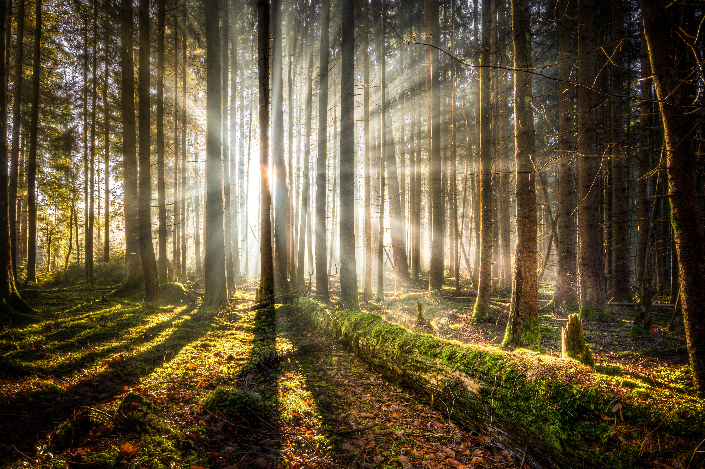
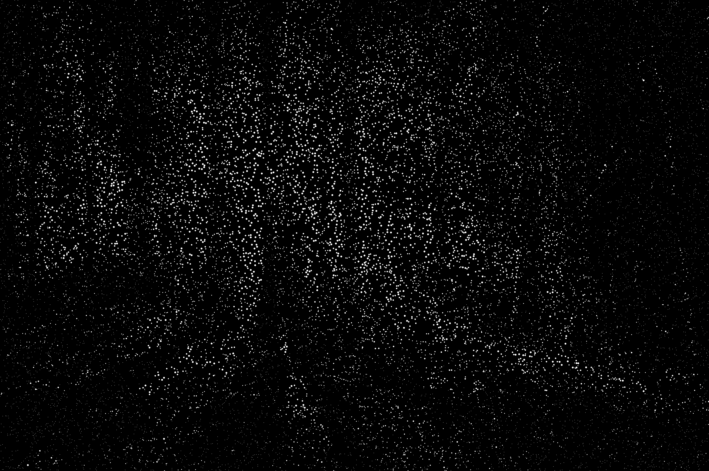
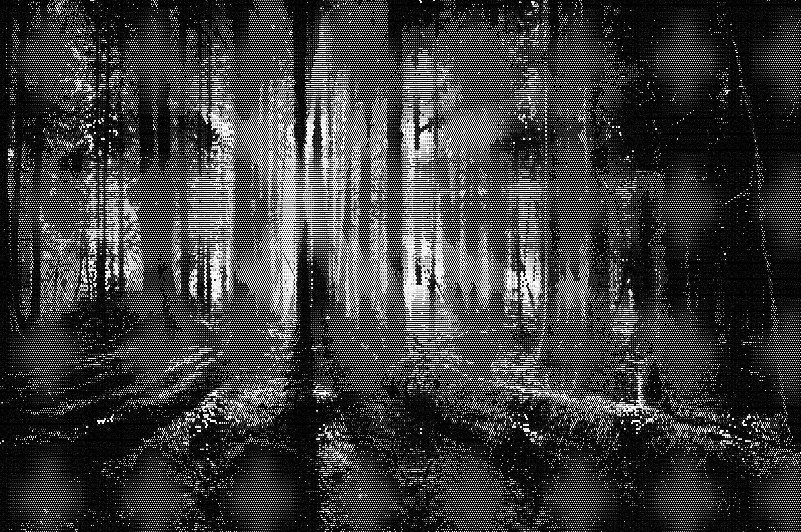

# Creative Python demos

I created this repo as a demonstration of some creative things people could do with Python for a
free class at the local library.

Most of the code and concepts are pretty simple to be understandable to a beginning Python
programmer.  The color clustering is the exception as it uses numpy arrays and methods.  As k-means
is a pretty straightforward algorithm, maybe there is potential future work is to re-implement it
with only standard library stuff.

## Image Circles

For this one, the idea is to reproduce an image just using white circles on a black background.  The
idea being that I could use the result as a template drill or cut circles in a material to make a 
cool pattern on a screen or shade or something.

**Input**



**Output** 

Using the `random` placement:



Using the `grid` placement option:



**Usage**

```shell
python image_circles.py random ./examples/forest.png ./examples/image-circles-random.png
# or 
python image_circles.py grid ./examples/forest.png ./examples/image-circles-grid.png
```

The size of the circles can also be set at the top of the file:

``` Python
# Constants
MIN_DISTANCE = 1
MIN_SIZE = 1
MAX_SIZE = 10
```


## Image Color Clustering

For this one, the idea is to reproduce an image using only *k* colors using *k*-means clustering.
That is to say, use the RGB value of each pixel as a 3D vector and cluster all pixels, iteratively
updating as normal.  Note the (x, y) position of the pixel is not considered but
neighbouring pixels tend to end up in the same cluster.

Sort of inspired by Shepard Fairey's famous Obama picture.

Forest picture with 12 clusters:


Portrait original ([source](https://creativecommons.org/2018/04/03/business-model-based-sharing/))


Portrait 5 clusters:


Portrait 12 clusters (though it looks like some are unused):


**Usage** 
```shell
python image_clustering.py ./examples/forest.png ./examples/forest-clustered.png 12
```


## Ambigram Names

An [ambigram](https://en.wikipedia.org/wiki/Ambigram) "is a calligraphic design whose written form
has several interpretations."  For my purposes, you can write it in such a way that it can be
flipped over and still read.

See [the Princess Bride ambigram](https://boingboing.net/2009/01/11/princess-bride-dvd-a.html).

Names found:

```
Ab
Babe
Effa
Etna
Etta
Hoy
Ivan
Jean
Jon
Lauren
Lon
Neal
Otto
Vina
Wm
```

TODO: Sketch an example of the output.


## Anagram Names

Using the same set of names, this script finds sets of anagrams.  It's pretty simple; not nearly as
interesting as I'd hoped.  Maybe future work could be finding anagrams from pairs of names or making
a set of less common names.  

Largest set of names:

```text
Aden Dean Dena Edna
```

Longest names:

```
Christian Christina
Benjamin Benjiman
Caroline Cornelia
Cristian Cristina
Dorothea Theodora
Katheryn Kathryne
```

I guess the most popular names just tend to be highly similar and just letter swapped variations of
each other.


**Usage**

```sh
python anagram_names.py ./data/us_top_names.txt
```